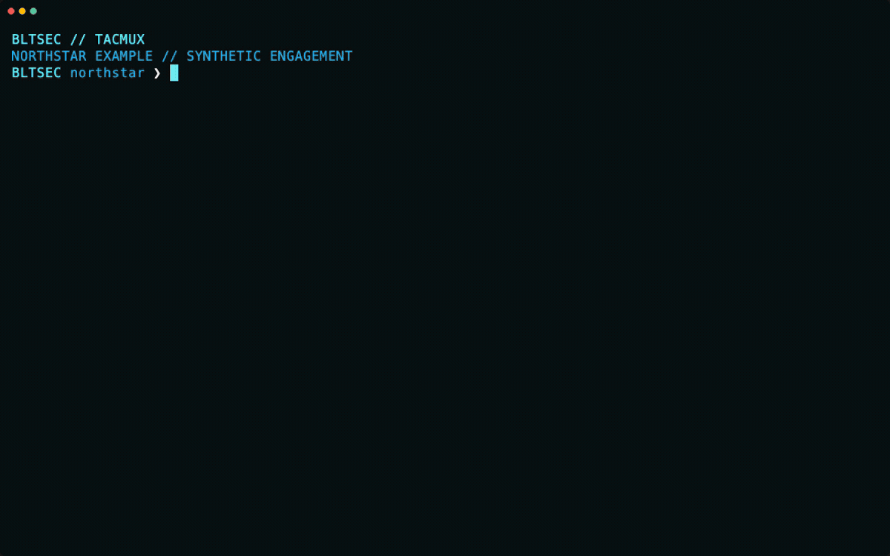

# TACMUX

<p align="center">
  
</p>

<p align="center">
  <a href="https://github.com/BLTSEC/TACMUX/actions/workflows/ci.yml"></a>
  <a href="https://github.com/BLTSEC/TACMUX/releases/latest"></a>
  <a href="LICENSE"></a>
</p>

TACMUX is a terminal cockpit for authorized penetration tests and red-team
engagements. It keeps scope, targets, tmux sessions, records, evidence, and the
current situation in one private workspace.

<p align="center">
  
</p>

The recording uses only the repository's public synthetic fixture. Read the
[field guide](https://bltsec.com/blog/tacmux/) for the complete Northstar
walkthrough or the [operator guide](docs/USAGE.md) for reference material.

> Use TACMUX only with explicit authorization. Confirm scope, rules of
> engagement, logging, evidence handling, and retention before testing.

## Cockpit

Run `tacmux` and work from five views:

| Key | View | Purpose |
|---|---|---|
| `1` | Targets | Identity, addresses, services, access, sessions, and target actions |
| `2` | Scope | Networks, domains, exclusions, pivots, and discovery jobs |
| `3` | Records | Access, activity, findings, attack paths, and cleanup |
| `4` | Situation | Authorization, topology, and confirmed attack paths |
| `5` | Documents | Notes, SITREP, findings, exports, logs, and evidence |

Press `a` for actions, `Enter` for the selected item's default action, `/` to
filter, `?` for keys, or `Ctrl+P` for command search. Prefix + `E` opens the
cockpit from tmux.

## Requirements

- Linux, Python 3.11.4+, tmux 3.2+, and [uv](https://docs.astral.sh/uv/)
- A Nerd Font-enabled terminal and a terminal editor
- Optional: Nmap for discovery jobs and `cap` for NOCAP timelines

## Install

```bash
git clone --branch v2.5.1 --depth 1 https://github.com/BLTSEC/TACMUX.git
cd TACMUX
./install.sh
exec "$SHELL" -l
tacmux health
```

The installer keeps its files under `~/.local/share/tacmux`, links the command
into `~/.local/bin`, and preserves configured workspace paths during upgrades.
Use `./install.sh --workspace /approved/evidence` to select the workspace on a
first install. `--full-tmux` installs the complete tmux configuration;
`--skip-tmux` leaves tmux unchanged.

## Engagement loop

1. Press `n` in the picker and record the client, engagement, authorization,
   testing window, and known scope.
2. Open **Scope** before discovery. Mark internal scope unavailable until an
   approved route exists.
3. Press `d` to run constrained discovery or import Nmap XML or pasted hosts.
   Review every result as **Add**, **Merge**, or **Ignore**.
4. Select a target and press `Enter` to start or attach to its tmux session.
5. Use target actions to record access, activity, findings, and cleanup. Build
   confirmed attack paths from those records in **Situation**.
6. Review notes, generated documents, logs, and evidence in **Documents**.
   Create a handoff export when another operator or reporting workflow needs it.
7. Stop engagement sessions, resolve cleanup, close the engagement, and create
   a verified archive. Archiving does not delete the live workspace.

TACMUX assigns stable engagement and target IDs. Renaming a target does not move
its evidence or change its tmux identity. Authentication remains distinct from
command execution, and failed or no-result activity remains in the record
without becoming an attack-path step.

## CLI

```text
tacmux                         Open the cockpit
tacmux health                  Check configuration and tools
tacmux note TEXT...            Append a contextual note
tacmux activity RESULT ...     Record contextual activity
tacmux sitrep                  Print the current SITREP
tacmux export [handoff|full]   Create a Markdown handoff
tacmux clip                    Copy through the trusted clipboard path
tacmux archive verify FILE     Verify an archive and its member hashes
tacmux version                 Print the version
```

Creation, scope, discovery, targets, records, lifecycle, archive, and restore
remain cockpit workflows.

## Safety

- New data is owner-only by default: `0700` directories and `0600` files.
- Scope exclusions apply to validation, import review, and TACMUX-launched Nmap.
- TACMUX refuses unsafe workspace links and validates archive paths, identities,
  collisions, and hashes before restore.
- Exports are not redacted. Review them before sharing; use
  [DECON](https://bltsec.com/blog/decon/) when a derived copy must be sanitized.
- Automatic pane logging stays limited to TACMUX-owned sessions unless the
  configuration explicitly widens it.

See the [operator guide](docs/USAGE.md), [keybindings](docs/KEYBINDINGS.md), and
[security policy](SECURITY.md) for the full behavior and boundaries.

## Reproduce the tape

Install [VHS](https://github.com/charmbracelet/vhs) and FFmpeg, place `tacmux`
on `PATH`, then run:

```bash
scripts/render-demo.sh
```

The renderer builds an isolated temporary workspace from
`tests/fixtures/external_internal_example.json`; it never reads a real
engagement workspace.

## Remove

```bash
./uninstall.sh
```

Configuration, archives, workspaces, and unrelated commands are preserved.

## License

[MIT](LICENSE)
