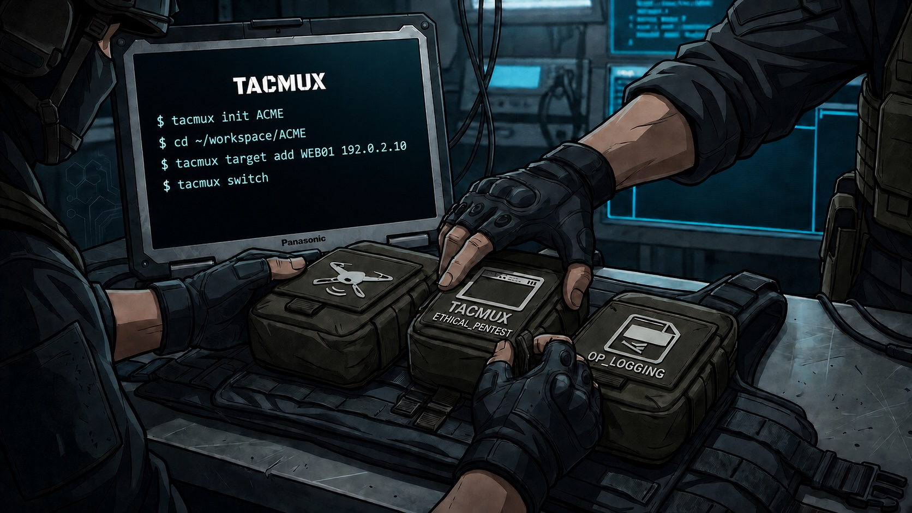

# TACMUX

<p align="center">
  
</p>

<p align="center">
  <a href="https://github.com/BLTSEC/TACMUX/actions/workflows/ci.yml"></a>
  <a href="LICENSE"></a>
</p>

TACMUX is a lean tmux-native workspace helper for authorized penetration tests and red-team operations. It keeps you in your shells while handling target sessions, pane logs, credentials, ports, tasks, cleanup, and a single editable situation report.

There is no dashboard to maintain. Target directories are inventory, `SITREP.md` is operational state, `fzf` is the switcher, and `$EDITOR` is the correction interface.

> Use TACMUX only with explicit authorization. You remain responsible for scope, rules of engagement, testing windows, evidence handling, and retention.

## Requirements

- Linux and Python 3.11+
- tmux and [fzf](https://github.com/junegunn/fzf)
- [uv](https://docs.astral.sh/uv/) for installation
- `$VISUAL`, `$EDITOR`, or `vi`
- Optional: Zsh; the installer enables completion for `tacmux` and `tm`
- Optional: Nmap for foreground host identification
- Optional: [NOCAP](https://github.com/BLTSEC/NOCAP) 2.3+ for engagement-wide captures

## Install

```bash
git clone --branch v3.0.0 --depth 1 https://github.com/BLTSEC/TACMUX.git
cd TACMUX
./install.sh --workspace ~/workspace
exec "$SHELL" -l
tacmux health
```

The installer places TACMUX under `~/.local/share/tacmux`, links the command into `~/.local/bin`, enables Zsh completion, and adds only the TACMUX integration fragment to an existing `~/.tmux.conf`. General tmux preferences belong to the operator or system loadout. Start a new shell after installation so completion is active.

## Start working

```bash
tacmux init ACME
cd ~/workspace/ACME
tacmux target add WEB01 192.0.2.10
tacmux switch
```

Inside the target session:

```bash
tm log "Nginx and SSH identified"
tm todo add "Enumerate the web application"
tm creds add
nmap -sV "$TARGET" | tm ports add
tm done "Obtained a shell as svc_web"
tm cleanup add "Remove uploaded payload"
tm status
```

`tm` is a recommended shell alias for `tacmux`; TACMUX itself installs only the `tacmux` executable.

## Core commands

```text
tacmux                         fzf session/target switcher
tacmux init [NAME]             create or open an engagement
tacmux target add|rename|delete
tacmux stop [TARGET]           stop a target or ops session
tacmux status [TARGET]         concise operational status
tacmux sitrep [SECTION]        edit SITREP at an optional heading
tacmux sitrep sync             validate and repair scaffolding
tacmux log [OUTCOME] TEXT      record an event
tacmux done TEXT               record a successful completed step
tacmux history [TARGET]        show narrative history
tacmux creds [view|add|check]  credentials and where they worked
tacmux ports [TARGET]          normalized port inventory
tacmux ports add [TARGET]      ingest Nmap normal output
tacmux todo [add|done]         planned and completed work
tacmux cleanup [add|done]      end-of-engagement obligations
tacmux discover               reviewed host identification
```

Missing values open short prompts or an `fzf` picker. Inline commands infer the engagement and target from the current directory or tmux session.

## Workspace

```text
~/workspace/ACME/
├── .tacmux/
├── SITREP.md
├── credentials/
│   ├── keys/
│   ├── creds.txt
│   ├── users.txt
│   ├── passwords.txt
│   └── hashes.txt
├── captures/
│   ├── .nocap/
│   ├── ops/
│   └── WEB01/
├── logs/YYYYMMDD/
└── targets/
    └── WEB01/
        ├── scans/
        ├── payloads/
        ├── loot/
        ├── screenshots/
        └── working/
```

`SITREP.md` contains Narrative, Targets, Credentials, Credential Checks, TODO, Completed, and Cleanup. TACMUX manages only the Markdown tables between its markers. Prose outside those markers remains operator-owned.

Narrative replaces separate note and activity systems:

```bash
tm log "SMB signing is disabled"                    # info
tm log failed "Recovered password was rejected"
tm log partial "Relay reached LDAP but no write"
tm done "Obtained shell as svc_web"                 # success
tm log                                                # interactive
tm log edit                                           # jump to Narrative
```

See the [operator guide](docs/USAGE.md), [keybindings](docs/KEYBINDINGS.md), and [security policy](SECURITY.md).

## Deliberate boundaries

TACMUX does not manage formal scope, authorization windows, findings, attack paths, report generation, engagement archives, multi-user collaboration, exploitation, or AI. Use the client RoE, reporting platform, filesystem/tar, and purpose-built tools for those jobs.

TACMUX stores raw credential material when you ask it to. Treat the entire engagement directory as sensitive evidence. Shared folders and cloud-synced paths may not enforce Unix permissions.

## Remove

```bash
./uninstall.sh
```

Configuration and engagement workspaces are preserved.

## License

[MIT](LICENSE)
